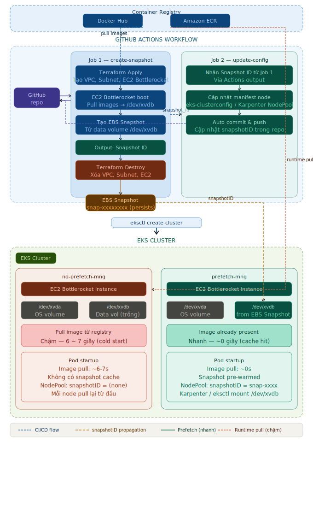

# Bottlerocket EBS Snapshot Cache

## 1. Bối cảnh

Khi hệ thống cần scale-out (HPA/Karpenter trigger thêm pod, node mới được provision), thời gian để pod đạt trạng thái **Ready** là yếu tố quan trọng ảnh hưởng đến khả năng đáp ứng tải.

Thời gian khởi động pod bao gồm nhiều giai đoạn:

```
Pod Startup Time = Node Provisioning + Image Pull + Container Start + Readiness Probe
```

| Giai đoạn | Mô tả | Cách tối ưu |
|---|---|---|
| Node Provisioning | Provision EC2 instance mới | Karpenter, warm pool |
| **Image Pull** | **Pull image từ registry** | **EBS Snapshot Cache (bài viết này)** |
| Container Start | Khởi động process trong container | Tối ưu application startup |
| Readiness Probe | Chờ app sẵn sàng nhận traffic | Tuning probe config |

Với image (~315MB), **Image Pull** chiếm phần đáng kể trong tổng thời gian startup — đặc biệt trên node mới chưa có image nào trong local cache. Bài viết này tập trung vào việc **giảm thời gian pull image** bằng cách cache sẵn image vào EBS snapshot trên Bottlerocket instances.

## 2. Giải pháp: EBS Snapshot Cache trên Bottlerocket

[Bottlerocket](https://github.com/bottlerocket-os/bottlerocket) là OS chuyên chạy container của AWS, sử dụng 2 volume:
- `/dev/xvda` — OS volume
- `/dev/xvdb` — Data volume (lưu trữ container images)

Ý tưởng: **Pull image trước vào data volume → tạo EBS snapshot → gắn snapshot vào node mới khi scale**. Node mới khởi động đã có sẵn image trong data volume → pod không cần pull từ registry → **giảm thời gian startup đáng kể**.

### Kiến trúc



### Quy trình tạo snapshot (GitHub Actions)

Workflow `create-snapshot.yml` gồm 2 jobs:

**Job 1 — create-snapshot:**
1. Terraform tạo hạ tầng tạm thời (VPC, Subnet, EC2 Bottlerocket)
2. EC2 Bottlerocket khởi động và pull các container images được chỉ định
3. Tạo EBS snapshot từ data volume (`/dev/xvdb`)
4. Terraform destroy xóa toàn bộ hạ tầng tạm, chỉ giữ lại snapshot

**Job 2 — update-config:**
1. Cập nhật `snapshotID` mới vào `eks-clusterconfig.yaml`
2. Auto commit & push về repo

**Tham số workflow:**

| Tham số | Mô tả | Mặc định |
|---|---|---|
| `aws_region` | AWS Region | `ap-northeast-1` |
| `environment` | Môi trường (dev/staging/prod) | `dev` |
| `container_images` | Danh sách images cần cache (phân cách bằng dấu phẩy) | `public.ecr.aws/eks-distro/kubernetes/pause:3.2` |
| `instance_type` | Loại EC2 tạm thời | `t2.small` |
| `vpc_cidr` | CIDR cho VPC tạm | `10.0.0.0/16` |

## 3. Tối ưu Dockerfile cho snapshot cache

Để tận dụng tối đa snapshot cache khi deploy version mới, Dockerfile cần tách các layer ít thay đổi (JRE, dependencies) ra khỏi layer thay đổi thường xuyên (application code).

Image `banking-demo` sử dụng multi-stage build với Spring Boot layered jar:

```dockerfile
FROM maven:3.9-eclipse-temurin-17 AS build
WORKDIR /app
COPY pom.xml .
RUN mvn dependency:go-offline
COPY src ./src
RUN mvn clean package -DskipTests

FROM eclipse-temurin:17-jre AS extract
WORKDIR /app
COPY --from=build /app/target/*.jar app.jar
RUN java -Djarmode=layertools -jar app.jar extract

FROM eclipse-temurin:17-jre
WORKDIR /app
COPY --from=extract /app/dependencies/ ./
COPY --from=extract /app/spring-boot-loader/ ./
COPY --from=extract /app/snapshot-dependencies/ ./
COPY --from=extract /app/application/ ./
EXPOSE 8080
ENTRYPOINT ["java", "org.springframework.boot.loader.launch.JarLauncher"]
```

| Layer | Nội dung | Thay đổi khi |
|---|---|---|
| `eclipse-temurin:17-jre` | Base image + JRE | Upgrade JRE |
| `dependencies/` | Maven dependencies | Thêm/sửa dependency |
| `spring-boot-loader/` | Spring Boot loader | Upgrade Spring Boot |
| `snapshot-dependencies/` | SNAPSHOT dependencies | Hiếm khi |
| `application/` | Application code | **Mỗi lần deploy** |

> Khi deploy version mới, chỉ layer `application/` thay đổi → các layer nặng (JRE, dependencies) đã có sẵn trong snapshot cache → giảm đáng kể thời gian pull.

## 4. Kiểm thử

### Môi trường

| | |
|---|---|
| **Cluster** | bottlerocket-cache-cluster |
| **Region** | ap-northeast-1 |
| **Instance type** | t3.medium |
| **AMI** | Bottlerocket for EKS |
| **Image test** | `chucthien03/banking-demo` (~315MB) |
| **Snapshot ID** | `snap-008ee0f167abf3f77` (chứa image v1) |

### Kịch bản

Triển khai 2 node group trên cùng một EKS cluster:

| Node Group | Mô tả | EBS Snapshot |
|---|---|---|
| `no-prefetch-mng` | Node thường, không có cache | Không |
| `prefetch-mng` | Node có gắn EBS snapshot chứa image v1 | `snap-008ee0f167abf3f77` |

Deploy cùng một pod lên mỗi node group, đo thời gian pull image qua Kubernetes events.

- **Test 1:** Deploy image `banking-demo:1` (exact match với snapshot)
- **Test 2:** Deploy image `banking-demo:2` (version mới, chia sẻ layers với v1)

### Kết quả

**Test 1: Exact match — image v1 khớp chính xác với snapshot**

| Node Group | Image | Pull Time | Event |
|---|---|---|---|
| no-prefetch-mng | `banking-demo:1` | **6.4s** | `Pulling` → `Successfully pulled` |
| prefetch-mng | `banking-demo:1` | **0s** | `Already present on machine` |

> Image match chính xác → container khởi động ngay lập tức, không cần pull.

**Test 2: Shared layers — image v2 chia sẻ layers với v1 trong snapshot**

| Node Group | Image | Pull Time | Event |
|---|---|---|---|
| no-prefetch-mng | `banking-demo:2` | **7.2s** | `Pulling` → `Successfully pulled` |
| prefetch-mng | `banking-demo:2` | **3.3s** | `Pulling` → `Successfully pulled` |

> Image v2 không có trong snapshot nhưng chia sẻ common layers với v1 → chỉ cần pull các layer thay đổi.

### Phân tích layers

v1 và v2 chia sẻ **9/10 layers**, chỉ khác layer cuối cùng:

```bash
$ docker inspect chucthien03/banking-demo:1 -f '{{json .RootFS.Layers}}' | jq .
$ docker inspect chucthien03/banking-demo:2 -f '{{json .RootFS.Layers}}' | jq .
```

| Layer | v1 | v2 |
|---|---|---|
| 1 | `f2a7f072..` | `f2a7f072..` |
| 2 | `2f61c7a4..` | `2f61c7a4..` |
| 3 | `7d58b159..` | `7d58b159..` |
| 4 | `f953134c..` | `f953134c..` |
| 5 | `87ee703d..` | `87ee703d..` |
| 6 | `ca1f67f2..` | `ca1f67f2..` |
| 7 | `922142ec..` | `922142ec..` |
| 8 | `322972c1..` | `322972c1..` |
| 9 | `5f70bf18..` | `5f70bf18..` |
| 10 | `2800d1f2..` ⚠️ | `3a15b5bf..` ⚠️ |

Khi pull v2 trên node có cache v1:
```bash
$ docker pull chucthien03/banking-demo:2
817807f3c64e: Already exists
a63239663e8a: Already exists
da1ae756ce2b: Already exists
58843afac925: Already exists
8d515e2ee9d6: Already exists
403538b7f05c: Already exists
7a3e37667c8e: Already exists
6f0769704f40: Already exists
4f4fb700ef54: Already exists
c38f0cfa10d9: Pull complete    # ← chỉ layer này cần pull
```

> 9 layers `Already exists` → chỉ pull 1 layer mới → giải thích tại sao prefetch node nhanh hơn ~54%.

### Tổng hợp

| Scenario | no-prefetch | prefetch | Tiết kiệm |
|---|---|---|---|
| Exact match (v1) | 6.4s | **0s** | **100%** |
| Shared layers (v2) | 7.2s | **3.3s** | **~54%** |

## 5. Chiến lược triển khai

Dựa trên kết quả thực nghiệm, có 2 chiến lược áp dụng snapshot cache:

### Chiến lược 1: Snapshot mỗi release

Tạo EBS snapshot mới mỗi khi có release mới (mỗi lần build image → tạo snapshot tương ứng).

| | |
|---|---|
| **Cách hoạt động** | CI/CD pipeline tự động tạo snapshot sau mỗi lần build image mới |
| **Pull time** | **0s** — image luôn exact match với snapshot |
| **Chi phí** | Cao — mỗi release tạo 1 snapshot mới, tốn chi phí lưu trữ và thời gian chạy workflow |
| **Phù hợp** | Ứng dụng critical cần boot time tối thiểu, release ít (weekly/monthly) |

### Chiến lược 2: Snapshot theo window release

Tạo EBS snapshot định kỳ theo chu kỳ (ví dụ: mỗi sprint, mỗi tháng), không tạo snapshot mỗi release.

| | |
|---|---|
| **Cách hoạt động** | Tạo snapshot theo lịch cố định, các release giữa các window tận dụng shared layers từ snapshot cũ |
| **Pull time** | **3-4s** — không exact match nhưng shared layers giúp giảm đáng kể so với không có cache |
| **Chi phí** | Thấp — ít snapshot hơn, giảm chi phí lưu trữ và thời gian chạy workflow |
| **Phù hợp** | Ứng dụng release thường xuyên (daily), chấp nhận pull time vài giây |

Chiến lược này đạt hiệu quả nhờ sự kết hợp của 2 yếu tố:

**a) Dockerfile layered build** — Tách image thành nhiều layer theo tần suất thay đổi (như đã mô tả ở mục 3). Các layer nặng (base image, JRE, dependencies) nằm dưới cùng và hiếm khi thay đổi, chỉ layer `application/` nhẹ ở trên cùng thay đổi mỗi lần deploy. Nhờ đó, dù image tag mới không khớp snapshot, phần lớn layers vẫn được tái sử dụng từ cache.

**b) Docker Buildx registry cache** — Workflow `build-image.yml` sử dụng Buildx với cache lưu trên registry:

```yaml
docker buildx build \
  --cache-from type=registry,ref="$CACHE_IMAGE:latest" \
  --cache-to type=registry,ref="$CACHE_IMAGE:latest",mode=max \
  ./app
```

- `--cache-from`: Tải cache từ image `banking-demo-cache:latest` trên registry, tái sử dụng các layer không thay đổi từ lần build trước.
- `--cache-to` với `mode=max`: Lưu **tất cả** layers (bao gồm cả intermediate layers từ multi-stage build) lên registry, không chỉ layers của final image.

Kết quả: mỗi lần build version mới, Buildx chỉ build lại layer `application/` — các layer khác được lấy từ registry cache. Điều này đảm bảo image mới luôn chia sẻ tối đa layers với image cũ trong snapshot, giữ hiệu quả cache ở mức ~54% ngay cả khi không tạo snapshot mới.


### So sánh

| | Snapshot mỗi release | Snapshot theo window |
|---|---|---|
| Pull time | **0s** (exact match) | **3-4s** (shared layers) |
| Chi phí snapshot | Cao (N snapshot / N release) | Thấp (1 snapshot / window) |
| Chi phí workflow | Cao (chạy mỗi release) | Thấp (chạy định kỳ) |
| Độ phức tạp CI/CD | Cao | Thấp |
| Hiệu quả cache | **100%** | **~54%** |

> **Khuyến nghị:** Kết hợp Dockerfile layered build (tách application code thành layer riêng) với chiến lược 2 để đạt cân bằng tốt giữa chi phí và hiệu quả. Các layer nặng (JRE, dependencies) ít thay đổi sẽ được tái sử dụng từ snapshot, chỉ layer application nhẹ cần pull mới.

## 6. Kết luận

- **Exact match:** Snapshot cache loại bỏ hoàn toàn thời gian pull image, container khởi động gần như instant.
- **Shared layers:** Dù image không khớp chính xác, các layer chung từ snapshot vẫn giúp giảm đáng kể thời gian pull (~54%).
- **Dockerfile layered build:** Tách application code thành layer riêng, đảm bảo các layer nặng (JRE, dependencies) được tái sử dụng từ snapshot cache qua các lần deploy.
- **Chiến lược triển khai:** Tùy theo tần suất release và yêu cầu về boot time, chọn snapshot mỗi release (tối ưu tốc độ) hoặc snapshot theo window (tối ưu chi phí).
- Với image lớn hơn (1GB+), hiệu quả của snapshot cache sẽ càng rõ rệt hơn.
